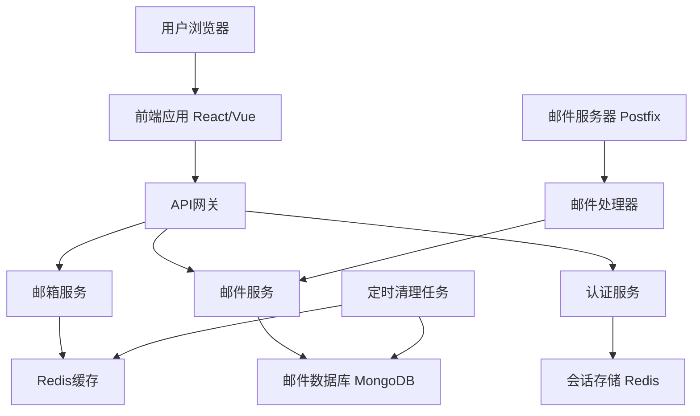
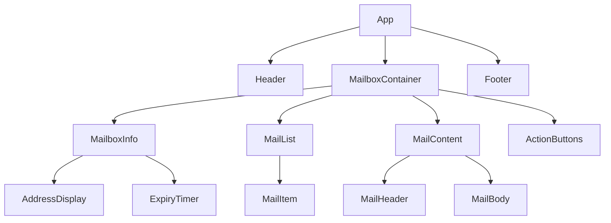

# Design Document

## Overview

临时邮箱网站是一个基于 Web 的应用程序，为用户提供临时邮箱服务。系统采用前后端分离架构，前端使用现代 JavaScript 框架构建响应式用户界面，后端使用 Node.js 构建 RESTful API 服务，并集成邮件服务器来处理邮件接收和存储。

核心功能包括：临时邮箱生成、实时邮件接收、邮件内容展示、邮箱生命周期管理和用户会话管理。

## Architecture

### 系统架构图



### 技术栈选择

**前端:**

- React.js + TypeScript - 构建用户界面
- Tailwind CSS - 样式框架，支持响应式设计
- Socket.io-client - 实时通信
- Axios - HTTP 客户端

**后端:**

- Node.js + Express.js - Web 服务器框架
- TypeScript - 类型安全
- Socket.io - WebSocket 实时通信
- JWT - 用户认证

**数据存储:**

- MongoDB - 邮件内容存储
- Redis - 会话缓存和临时数据

**邮件服务:**

- Postfix - 邮件服务器
- Nodemailer - 邮件处理库

**部署:**

- Docker - 容器化部署
- Nginx - 反向代理和静态文件服务

## Components and Interfaces

### 前端组件架构



### 核心组件说明

**MailboxContainer**: 主容器组件，管理邮箱状态和邮件数据
**MailboxInfo**: 显示邮箱地址、有效期和统计信息
**MailList**: 邮件列表组件，支持实时更新
**MailContent**: 邮件内容展示组件，支持 HTML 渲染
**ActionButtons**: 操作按钮组，包括刷新、清空、延期等功能

### API 接口设计

#### 邮箱管理接口

```typescript
// 生成新邮箱
POST /api/mailbox/generate
Response: {
  mailboxId: string,
  address: string,
  token: string,
  expiresAt: Date
}

// 获取邮箱信息
GET /api/mailbox/:mailboxId
Headers: { Authorization: Bearer <token> }
Response: {
  address: string,
  expiresAt: Date,
  mailCount: number
}

// 延长邮箱有效期
POST /api/mailbox/:mailboxId/extend
Headers: { Authorization: Bearer <token> }
Response: {
  expiresAt: Date,
  extensionsLeft: number
}

// 删除邮箱
DELETE /api/mailbox/:mailboxId
Headers: { Authorization: Bearer <token> }
```

#### 邮件管理接口

```typescript
// 获取邮件列表
GET /api/mailbox/:mailboxId/mails
Headers: { Authorization: Bearer <token> }
Query: { page?: number, limit?: number }
Response: {
  mails: Mail[],
  total: number,
  hasMore: boolean
}

// 获取邮件详情
GET /api/mailbox/:mailboxId/mails/:mailId
Headers: { Authorization: Bearer <token> }
Response: Mail

// 删除邮件
DELETE /api/mailbox/:mailboxId/mails/:mailId
Headers: { Authorization: Bearer <token> }

// 清空邮箱
DELETE /api/mailbox/:mailboxId/mails
Headers: { Authorization: Bearer <token> }
```

#### WebSocket 事件

```typescript
// 客户端订阅邮箱更新
socket.emit("subscribe", { mailboxId, token });

// 服务器推送新邮件
socket.emit("newMail", { mailboxId, mail: Mail });

// 服务器推送邮箱过期提醒
socket.emit("expiryWarning", { mailboxId, expiresAt: Date });
```

## Data Models

### 邮箱模型 (Mailbox)

```typescript
interface Mailbox {
  id: string; // 邮箱唯一标识
  address: string; // 邮箱地址 (random@nnu.edu.kg)
  token: string; // 访问令牌
  createdAt: Date; // 创建时间
  expiresAt: Date; // 过期时间
  extensionCount: number; // 延期次数
  isActive: boolean; // 是否激活
  lastAccessAt: Date; // 最后访问时间
}
```

### 邮件模型 (Mail)

```typescript
interface Mail {
  id: string; // 邮件唯一标识
  mailboxId: string; // 所属邮箱ID
  from: string; // 发件人
  to: string; // 收件人
  subject: string; // 邮件主题
  textContent: string; // 纯文本内容
  htmlContent?: string; // HTML内容
  attachments: Attachment[]; // 附件列表
  receivedAt: Date; // 接收时间
  isRead: boolean; // 是否已读
  size: number; // 邮件大小(字节)
}

interface Attachment {
  filename: string;
  contentType: string;
  size: number;
  contentId?: string;
}
```

### 会话模型 (Session)

```typescript
interface Session {
  mailboxId: string;
  token: string;
  createdAt: Date;
  lastAccessAt: Date;
  userAgent: string;
  ipAddress: string;
}
```

## Error Handling

### 错误分类和处理策略

#### 客户端错误处理

```typescript
enum ErrorType {
  NETWORK_ERROR = "NETWORK_ERROR",
  VALIDATION_ERROR = "VALIDATION_ERROR",
  AUTHENTICATION_ERROR = "AUTHENTICATION_ERROR",
  NOT_FOUND_ERROR = "NOT_FOUND_ERROR",
  RATE_LIMIT_ERROR = "RATE_LIMIT_ERROR",
}

interface ErrorResponse {
  error: {
    type: ErrorType;
    message: string;
    code: string;
    details?: any;
  };
}
```

#### 错误处理机制

1. **网络错误**: 自动重试机制，最多重试 3 次，指数退避
2. **认证错误**: 清除本地 token，重定向到首页
3. **邮箱过期**: 显示过期提示，引导用户生成新邮箱
4. **服务器错误**: 显示友好错误信息，提供重试选项
5. **限流错误**: 显示等待提示，自动重试

#### 日志记录

```typescript
interface LogEntry {
  level: "info" | "warn" | "error";
  timestamp: Date;
  message: string;
  context: {
    mailboxId?: string;
    userId?: string;
    action: string;
    error?: Error;
  };
}
```

## Testing Strategy

### 测试金字塔

#### 单元测试 (70%)

- **前端组件测试**: 使用 Jest + React Testing Library
- **后端服务测试**: 使用 Jest + Supertest
- **工具函数测试**: 纯函数逻辑测试
- **数据模型测试**: 验证数据结构和验证逻辑

#### 集成测试 (20%)

- **API 集成测试**: 测试前后端接口交互
- **数据库集成测试**: 测试数据持久化逻辑
- **邮件服务集成测试**: 测试邮件接收和处理流程
- **WebSocket 集成测试**: 测试实时通信功能

#### 端到端测试 (10%)

- **用户流程测试**: 使用 Playwright 测试完整用户场景
- **跨浏览器测试**: 确保主流浏览器兼容性
- **移动端测试**: 测试响应式设计和触摸交互
- **性能测试**: 测试页面加载速度和响应时间

### 测试环境配置

```typescript
// 测试配置
interface TestConfig {
  database: {
    mongodb: "mongodb://localhost:27017/tempmail_test";
    redis: "redis://localhost:6379/1";
  };
  mail: {
    testMode: true;
    mockServer: "localhost:2525";
  };
  auth: {
    jwtSecret: "test-secret";
    tokenExpiry: "1h";
  };
}
```

### 测试数据管理

1. **测试数据隔离**: 每个测试用例使用独立的数据库
2. **数据清理**: 测试后自动清理生成的测试数据
3. **Mock 服务**: 使用 Mock 邮件服务器进行邮件测试
4. **测试覆盖率**: 目标代码覆盖率 > 80%

### 持续集成

```yaml
# CI/CD流程
stages:
  - lint: ESLint + Prettier检查
  - test: 运行所有测试套件
  - build: 构建生产版本
  - security: 安全漏洞扫描
  - deploy: 部署到测试环境
```

这个设计文档涵盖了临时邮箱网站的完整技术架构，包括系统架构、组件设计、数据模型、错误处理和测试策略。设计考虑了可扩展性、安全性和用户体验，为后续的开发实现提供了详细的技术指导。
